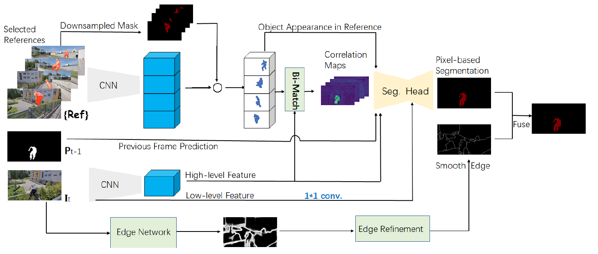

# Adaptive Selection of Reference Frames for Video Object Segmentation

TIP 2022

Lingyi Hong, Wei Zhang , Liangyu Chen, Wenqiang Zhang , Jianping Fan

The official PyTorch implementation of [Adaptive Selection of Reference Frames for Video Object Segmentation.](https://ieeexplore.ieee.org/document/9665289)

Model Overview:
<div align=center></div>


## Requirements
    1. Python3
    2. pytorch >= 1.3.0 and torchvision
    3. opencv-python and Pillow

## Inference
### Dataset
```
└── ADARS
    └── datasets
        └── DAVIS
            ├── Annotations
            └── ImageSets
            └── JPEGImages
    

```

### Download weights
Download the [pretrained weights](./picture/model.png) and put it in the `pretrain_models` folder

### Test
Run the following command to test on Davis 2017 validation set
```
sh eval.sh
```


## Citing
```
@ARTICLE{9665289,  
author={Hong, Lingyi and Zhang, Wei and Chen, Liangyu and Zhang, Wenqiang and Fan, Jianping},  
journal={IEEE Transactions on Image Processing},   
title={Adaptive Selection of Reference Frames for Video Object Segmentation},   
year={2022},  
volume={31},  
number={},  
pages={1057-1071},  
doi={10.1109/TIP.2021.3137660}
}
```

## Related Work
[CFBI](https://github.com/z-x-yang/CFBI)

